# Évaluation Architectures Micro-services -Hamza Braimi

## 📚Prerequisite

❕Architecture de projet

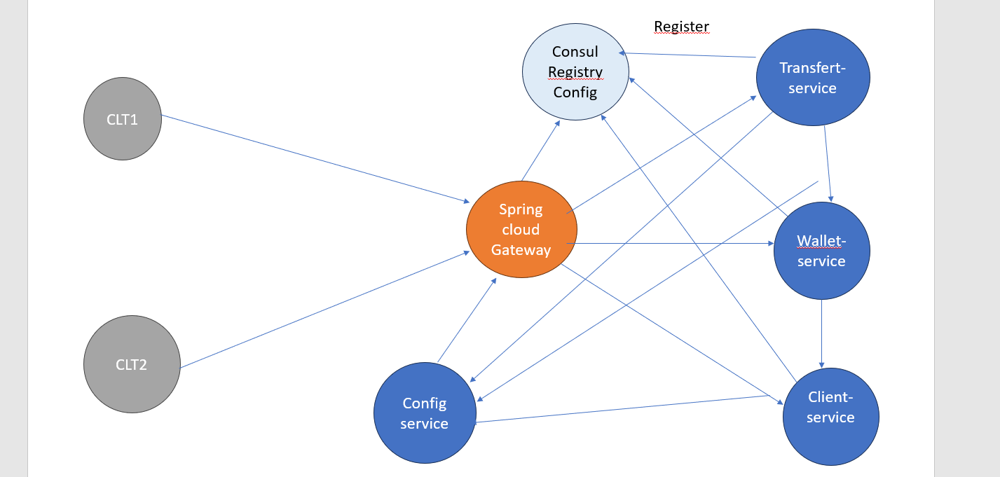

❕ Diagramme de classe

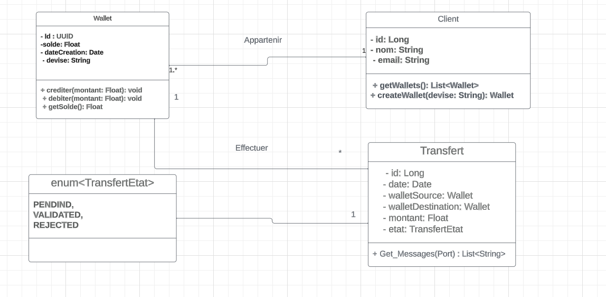

❕Conception de projet

## ❕Travail demandé :
1)Créer un Empty Project incluant les micro-services suivants : wallet-service, transfer-service, gateway-
service, discovery-service et config-service

a) Config Service 

on installer ces dependences

  <dependencies>
        <dependency>
            <groupId>org.springframework.boot</groupId>
            <artifactId>spring-boot-starter-actuator</artifactId>
        </dependency>
        <dependency>
            <groupId>org.springframework.cloud</groupId>
            <artifactId>spring-cloud-config-server</artifactId>
        </dependency>
        <dependency>
            <groupId>org.springframework.cloud</groupId>
            <artifactId>spring-cloud-starter-consul-discovery</artifactId>
        </dependency>

        <dependency>
            <groupId>org.springframework.boot</groupId>
            <artifactId>spring-boot-starter-test</artifactId>
            <scope>test</scope>
        </dependency>
    </dependencies>
    <dependencyManagement>
        <dependencies>
            <dependency>
                <groupId>org.springframework.cloud</groupId>
                <artifactId>spring-cloud-dependencies</artifactId>
                <version>${spring-cloud.version}</version>
                <type>pom</type>
                <scope>import</scope>
            </dependency>
        </dependencies>
    </dependencyManagement>

# et c'est configuration de config-service

package org.sid.configservice;

import org.springframework.boot.SpringApplication;
import org.springframework.boot.autoconfigure.SpringBootApplication;
import org.springframework.cloud.config.server.EnableConfigServer;

@SpringBootApplication
@EnableConfigServer
public class ConfigServiceApplication {

    public static void main(String[] args) {
        SpringApplication.run(ConfigServiceApplication.class, args);
    }

}

# proprties.application 

server.port=8888
spring.application.name=config-service
spring.cloud.config.server.git.uri=file:///C:/Users/HAMZA/Desktop/Exam/Spring-cloud2/Braimi-App/config-rep

-> leur Structure

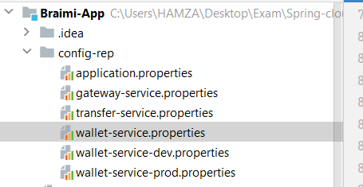

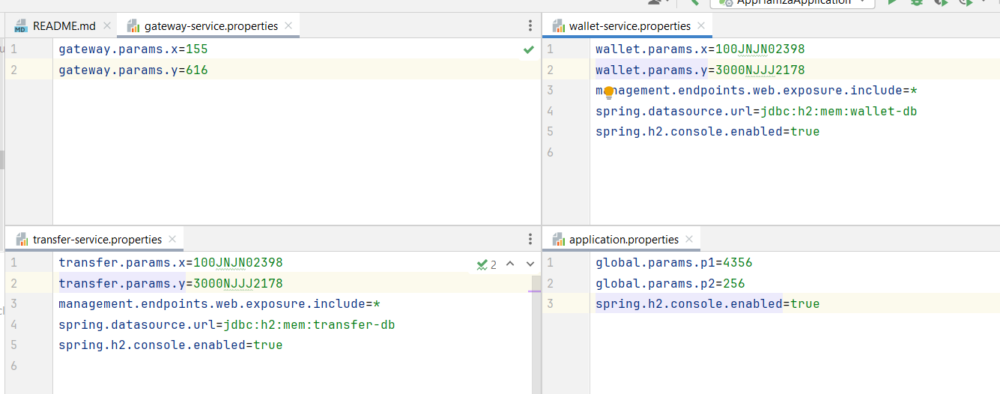
 

# On va demmarrer Consul pour savoir les different "Register Service"

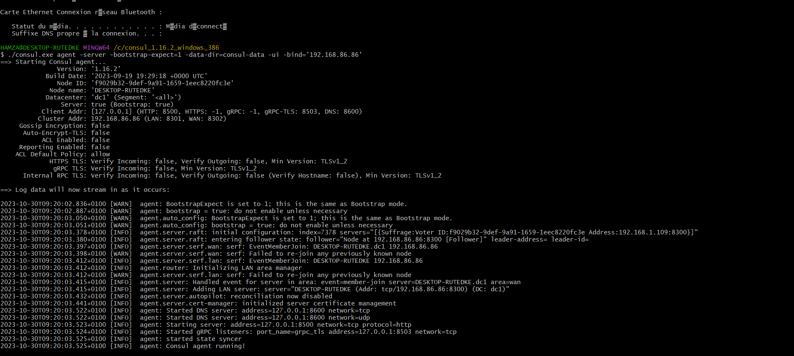

# On va creer Wallet-service
--> les entite
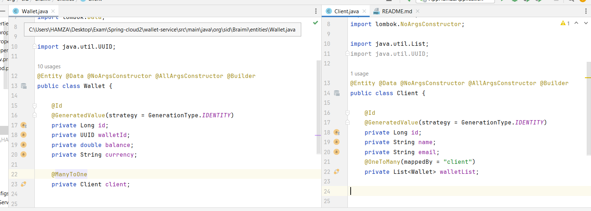
--> leurs projections

package org.sid.Braimi.entities;
import org.springframework.data.rest.core.config.Projection;

@Projection(name="fullClient",types = Client.class)
public interface ClientProjection {

    public int getId();
    public String getName();
    public String getEmail();
}

package org.sid.Braimi.entities;

@Projection(name="fullWallet",types = Wallet.class)
public interface WalletProjection {

    public int getId();
    public UUID getWalletId();
    public double getBalance();
    public String getCurrency();
}

-- Repository

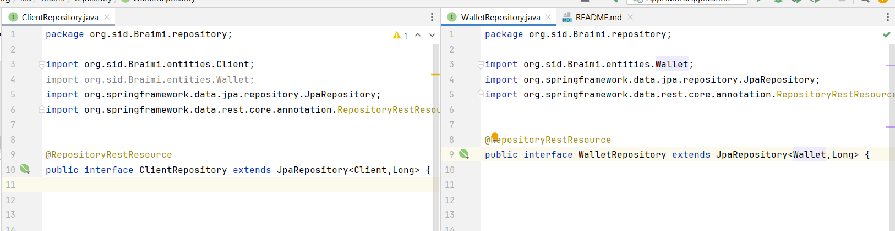

#Application Properties

server.port=8081
spring.application.name=wallet-service
spring.config.import=optional:configserver:http://localhost:8888

#Main pour tester

package org.sid.Braimi;

import org.sid.Braimi.entities.Client;
import org.sid.Braimi.entities.Wallet;
import org.sid.Braimi.repository.ClientRepository;
import org.sid.Braimi.repository.WalletRepository;
import org.springframework.boot.CommandLineRunner;
import org.springframework.boot.SpringApplication;
import org.springframework.boot.autoconfigure.SpringBootApplication;
import org.springframework.context.annotation.Bean;

import java.util.List;
import java.util.UUID;

@SpringBootApplication
public class WalletServiceApplication {

	public static void main(String[] args) {
		SpringApplication.run(WalletServiceApplication.class, args);
	}

	@Bean

	CommandLineRunner start(WalletRepository walletRepository, ClientRepository clientRepository){

		return args->{

			clientRepository.saveAll(
					List.of(
							
							Client.builder().name("HAMZA BRAIMI").email("hamza@Gmail.com").build(),
							Client.builder().name("Ahamdi BRAIMI").email("hamza@Gmail.com").build(),
							Client.builder().name("Hassan BRAIMI").email("hassani@Gmail.com").build()
					)
			);

			
			Client cl1=clientRepository.findById(1L).get();

			walletRepository.saveAll(
					List.of(

							Wallet.builder().walletId(UUID.randomUUID()).balance(1222).currency("DH").client(cl1).build(),
							Wallet.builder().walletId(UUID.randomUUID()).balance(1232).currency("DH").client(cl1).build(),
							Wallet.builder().walletId(UUID.randomUUID()).balance(1222).currency("DH").client(cl1).build(),
							Wallet.builder().walletId(UUID.randomUUID()).balance(1222).currency("DH").client(cl1).build(),
							Wallet.builder().walletId(UUID.randomUUID()).balance(1222).currency("DH").client(cl1).build()
							
					)
			);
			
			clientRepository.findAll().forEach(System.out::println);

		};
	}
}

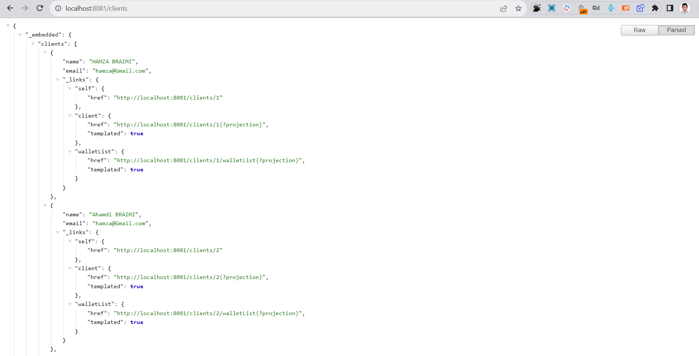
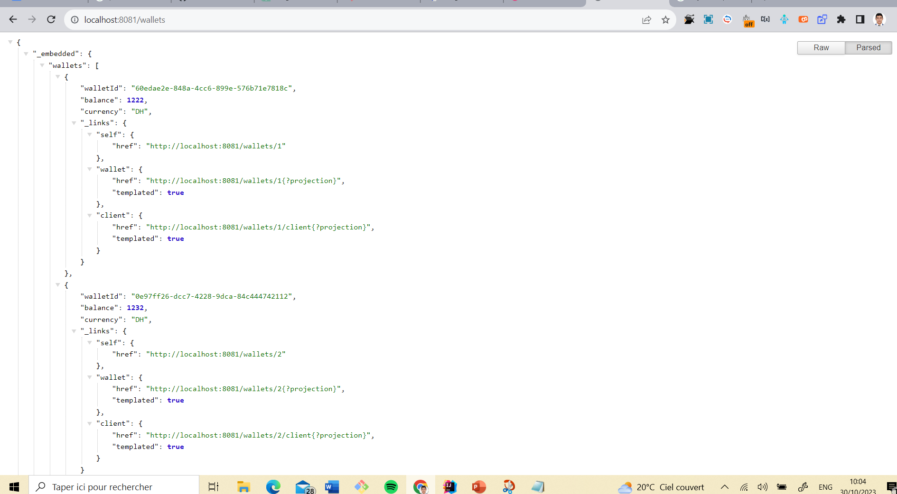

#Get way service 

package org.sid.gatewayservice;

import io.netty.resolver.DefaultAddressResolverGroup;
import org.springframework.boot.SpringApplication;
import org.springframework.boot.autoconfigure.SpringBootApplication;
import org.springframework.cloud.client.discovery.EnableDiscoveryClient;
import org.springframework.cloud.client.discovery.ReactiveDiscoveryClient;
import org.springframework.cloud.gateway.discovery.DiscoveryClientRouteDefinitionLocator;
import org.springframework.cloud.gateway.discovery.DiscoveryLocatorProperties;
import org.springframework.context.annotation.Bean;
import reactor.netty.http.client.HttpClient;

@SpringBootApplication
@EnableDiscoveryClient
public class GatewayServiceApplication {

	public static void main(String[] args) {
		SpringApplication.run(GatewayServiceApplication.class, args);
	}

	@Bean
	DiscoveryClientRouteDefinitionLocator definitionLocator(ReactiveDiscoveryClient rdc, DiscoveryLocatorProperties properties){

		return new DiscoveryClientRouteDefinitionLocator(rdc,properties);}

	@Bean
	public HttpClient httpClient() {
		return HttpClient.create().resolver(DefaultAddressResolverGroup.INSTANCE);
	}

}

# properties 
server.port=9999
spring.application.name=gateway-service
spring.config.import=optional:configserver:http://localhost:8888

spring:
cloud:
gateway:
globalcors:
corsConfigurations:
'[/**]':
allowedOrigins: "http://localhost:4200"
allowedHeaders: "*"
allowedMethods:
- GET
- POST
- PUT
- DELETE

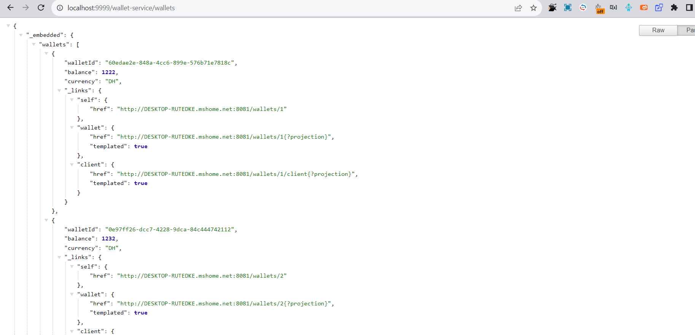
# Donc 

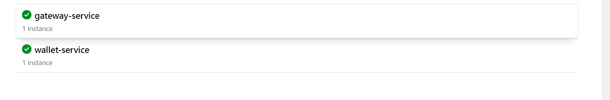

# Transfert Service

#Transfer-service

entity
package org.sid.ordersrvice.entities;

import jakarta.persistence.*;
import lombok.AllArgsConstructor;
import lombok.Builder;
import lombok.Data;
import lombok.NoArgsConstructor;
import org.sid.ordersrvice.enums.TransfertEtat;
import org.sid.ordersrvice.model.Wallet;

import java.util.Date;

@Entity @Data
@Table(name="orders")
@AllArgsConstructor @NoArgsConstructor @Builder
public class Transfer {

    @Id
    @GeneratedValue(strategy = GenerationType.IDENTITY)
    private Long id;
    private Date date;
    private double amount;
    private TransfertEtat status;

   
    private Long idsourceWallet;

    private Long  iddestinationWallet;

    @Transient

    private Wallet wallet ;

}

#Enums

package org.sid.ordersrvice.enums;

public enum TransfertEtat {

    PENDIND, VALIDATED,
    REJECTED;
}

#Model Wallet

import lombok.Data;

import java.util.UUID;

@Data
public class Wallet {

private Long id;
private UUID walletId;
private double balance;
private String currency;
}

# Transfer Repository 

@RepositoryRestResource
public interface TransferRepository extends JpaRepository<Transfer, Long> {
@RestResource(path = "/byWalletId")
List<Transfer> findByCustomerId(@Param("WalletId") Long WalletId);
}

# service WalletRestClientUsingOpenFeign
package org.sid.ordersrvice.service;

import org.sid.ordersrvice.model.Wallet;
import org.springframework.cloud.openfeign.FeignClient;
import org.springframework.hateoas.PagedModel;
import org.springframework.web.bind.annotation.GetMapping;
import org.springframework.web.bind.annotation.PathVariable;

@FeignClient(name="wallet-service")
public interface WalletRestClientService {

    @GetMapping(path="/customers?projection=fullWallet")
    public PagedModel<Wallet> allWallet();

}

#Web Package TransfertRestController

package org.sid.ordersrvice.web;

import org.sid.ordersrvice.Repository.TransferRepository;
import org.sid.ordersrvice.entities.Transfer;
import org.sid.ordersrvice.service.WalletRestClientService;
import org.springframework.web.bind.annotation.GetMapping;
import org.springframework.web.bind.annotation.PathVariable;
import org.springframework.web.bind.annotation.RestController;

@RestController
public class TransferRestController {

    private TransferRepository transferRepository;

    public TransferRestController(TransferRepository transferRepository, WalletRestClientService walletRestClientServicee) {
        this.transferRepository = transferRepository;
        this.walletRestClientServicee = walletRestClientServicee;
    }

    private WalletRestClientService walletRestClientServicee;

    @GetMapping("/fullTransfer/{id}")

    public Transfer getTransfer(@PathVariable(name="id") Long id){

        Transfer transfer=transferRepository.findById(id).get();

        transfer.setWallet(walletRestClientServicee.walletById(transfer.getIdsourceWallet()));

    return transfer;}

}

#fichier config
server.port =8083
spring.application.name=transfer-service
spring.config.import=optional:configserver:http://localhost:8888

#For get Loggs of OpenFeign
#Bridge of loggs between Customer-Order
logging.level.org.sid.ordersrvice.service.WalletRestClientService=debug

spring.cloud.openfeign.client.default-config=full

#Consul

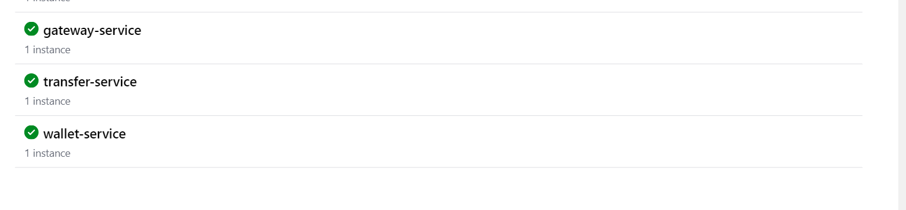

#Front Ennd 

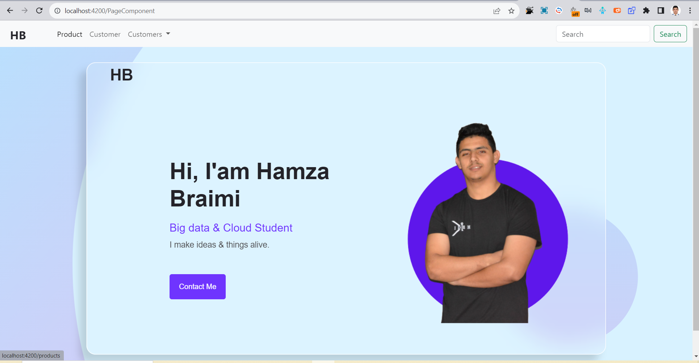

# recuperer wallet

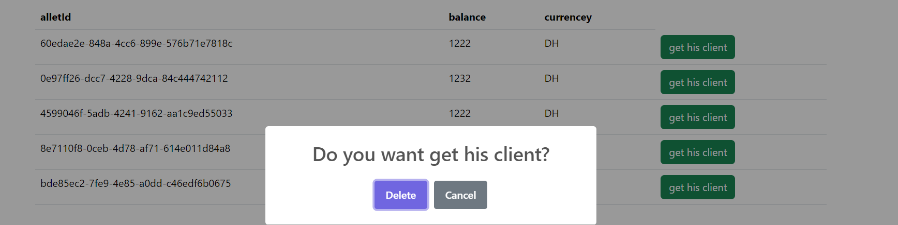

    <table class="table" *ngIf="customers">
      <thead>
      <tr>
        <th>alletId</th> <th>balance</th> <th>currencey</th>
      </tr>
      </thead>
      <tbody>
        <tr *ngFor="let p of customers._embedded.wallets">
          <td>{{p.walletId}}</td>
          <td>{{p.balance}}</td>
          <td>{{p.currency}}</td>
          <td>
            <button class="btn btn-success" (click)="getOrders(p)">get his client</button>
          </td>

        </tr>
      </tbody>
    </table>
  
 

# js

import { Component,OnInit } from '@angular/core';
import {HttpClient} from "@angular/common/http";
import {ActivatedRoute, Router} from "@angular/router";
import Swal from 'sweetalert2';

@Component({
selector: 'app-customers',
templateUrl: './customers.component.html',
styleUrls: ['./customers.component.css']
})
export class CustomersComponent implements OnInit {

customers : any;
constructor(private http:HttpClient, private router: Router, private route:ActivatedRoute) { }

ngOnInit(): void {
this.http.get("http://localhost:9999/wallet-service/wallets").subscribe({
next:(data)=>{

      this.customers=data;

      },error:(err)=>{

      }
    })

}

getClient(c: any) {
Swal.fire({
title: 'Do you want get his client?',
showDenyButton: false,
showCancelButton: true,
confirmButtonText: 'Delete',
}).then((result) => {
if (result.isConfirmed) {
this.router.navigateByUrl("/orders/" + c.id);
} else {
alert("hhhh");
}
});

}

}

# Proposer une solution pour sécuriser l’application(keycloak)